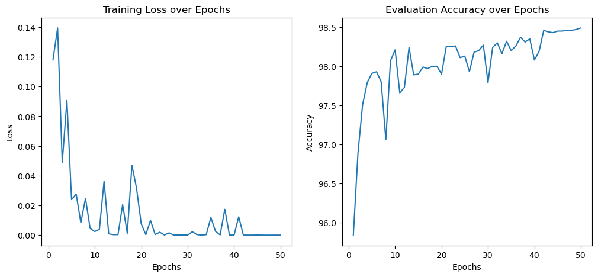

# 全连接神经网络 Mnist手写数字识别

## 实验目的
通过使用 PyTorch 实现一个简单的全连接神经网络，掌握模型定义、数据加载、训练与评估的完整流程，理解训练循环、损失函数与优化器的使用方法，并能在 MNIST 数据集上完成手写数字分类任务。

## 实验内容
### 导入依赖库
```python
import torch
import torchvision.transforms as transforms
import torchvision.datasets as datasets
import torch.nn as nn
import torch.optim as optim
from torch.functional import F
```

### 超参数与数据加载
通过设置超参数BATCH SIZE设置了每一批被放入模型训练的数据量，EPOCHS设置了数据集被训练的轮数。通过设置device来将数据和模型都放置在GPU上来加快训练速度，在后面定义模型和加载数据时使用了to(device)来实现。

使用了dataset来加载MNIST手写数字数据集，并通过dataloader将数据转化为可以分批输出的加载器形式，同时定义了训练数据集以及测试数据集，在训练过程中可以通过改变模型的模式来达到训练和验证的效果。
```python
BATCH_SIZE = 256
EPOCHS = 50

device = torch.device("cuda" if torch.cuda.is_available() else "cpu")

train_loader = torch.utils.data.DataLoader(
    datasets.MNIST('data', train=True, download=True,
                   transform=transforms.Compose([
                          transforms.ToTensor()
                     ])),
   batch_size=BATCH_SIZE, shuffle=True,
)

test_loader = torch.utils.data.DataLoader(
    datasets.MNIST('data', train=False, download=True,
                   transform=transforms.Compose([
                       transforms.ToTensor()
                   ])),
   batch_size=BATCH_SIZE, shuffle=True,
)
```

通过运行如下代码可以看到当前使用的设备信息

```python
device
```

> device(type='cuda')

### 模型定义
在模型定义过程中，将28*28的图片数据矩阵先拉平为784维的向量，同时这一步也可以在后面的训练中添加。设置了784-512-512-10的神经网络结构，都为全连接层，隐层数量为两层，使用了Relu作为激活函数。输出的应该是一个10个数字的可能性概率。

使用Adam作为优化器，学习率设置为0.001，使用了交叉熵损失函数。
```python
class Net(nn.Module):
    def __init__(self):
        super(Net, self).__init__()
        self.fc1 = nn.Linear(28*28, 512)
        self.fc2 = nn.Linear(512, 512)
        self.fc3 = nn.Linear(512, 10)

    def forward(self, x):
        x = x.view(-1, 28*28)
        x = F.relu(self.fc1(x))
        x = F.relu(self.fc2(x))
        x = self.fc3(x)
        return x

model = Net().to(device)
optimizer = optim.Adam(model.parameters(), lr=0.001)
criterion = nn.CrossEntropyLoss()
```

### 训练与评估循环
通过将inputs和targets也就是数据和真实值放在GPU上，从而可以在GPU的模型上进行训练，加快了训练速度。首先是梯度置零防止梯度爆炸，通过模型输入inputs输出结果，将模型输出结果和真实值计算交叉熵损失，然后进行反向传播更新模型的参数。

在验证过程中，就是计算在所有的数据中，通过argmax得到模型输出中概率最大的数字是否和真实值相同，统计正确的数量，从而输出准确率。
```python
model = Net().to(device)
optimizer = optim.Adam(model.parameters(), lr=0.001)
criterion = nn.CrossEntropyLoss()
losses = []
accuracies = []
for epoch in range(EPOCHS):
    model.train()
    for batch_idx, data in enumerate(train_loader):
        inputs, targets = data
        inputs, targets = inputs.to(device), targets.to(device)
        optimizer.zero_grad()
        outputs = model(inputs)
        loss = criterion(outputs, targets)
        loss.backward()
        optimizer.step()
    model.eval()
    correct = 0
    total = 0
    with torch.no_grad():
        for data in test_loader:
            inputs, targets = data
            inputs, targets = inputs.to(device), targets.to(device)
            outputs = model(inputs)
            _, predicted = torch.max(outputs.data, 1)
            total += targets.size(0)
            correct += (predicted == targets).sum().item()
    losses.append(loss.item())
    accuracies.append(100 * correct / total)
    print(f'Epoch {epoch+1}, Training Loss: {loss.item():.4f}, Eval Accuracy: {100 * correct / total:.2f}%')
```
### 可视化训练结果

再通过画图可视化观察训练损失和验证集准确率

```python
import matplotlib.pyplot as plt
plt.figure(figsize=(12, 5))
plt.subplot(1, 2, 1)
plt.plot(range(1,EPOCHS+1),losses)
plt.title('Training Loss over Epochs')
plt.xlabel('Epochs')
plt.ylabel('Loss')
plt.subplot(1, 2, 2)
plt.plot(range(1,EPOCHS+1),accuracies)
plt.title('Evaluation Accuracy over Epochs')
plt.xlabel('Epochs')
plt.ylabel('Accuracy')
plt.show()
```

> 

可以看到再训练初期，损失和准确率变化都十分明显，为了得到更好的效果，可以在模型中的全连接层加入Dropout随机丢弃一些连接或是加入早停机制来优化训练过程。

## 实验结果分析
- 训练过程中损失衰减以及准确度的上升在初期十分显著，但在后期有着震荡的表现
- 可以通过优化网络结构，加入dropout等操作来优化训练过程
- 成功将模型和数据移动到GPU上进行训练，加快了训练过程

## 实验小结
本次实验使用PyTorch实现了全连接神经网络对MNIST手写数字的分类任务。通过定义包含两个隐藏层的网络结构，采用ReLU激活函数和交叉熵损失函数，使用Adam优化器进行参数更新。实验过程中完成了数据加载、模型训练与评估的完整流程，成功将模型和数据移至GPU加速训练。训练结果显示，模型在测试集上达到了较高准确率，损失函数随训练轮数增加而下降。实验验证了全连接神经网络在手写数字识别任务中的有效性。